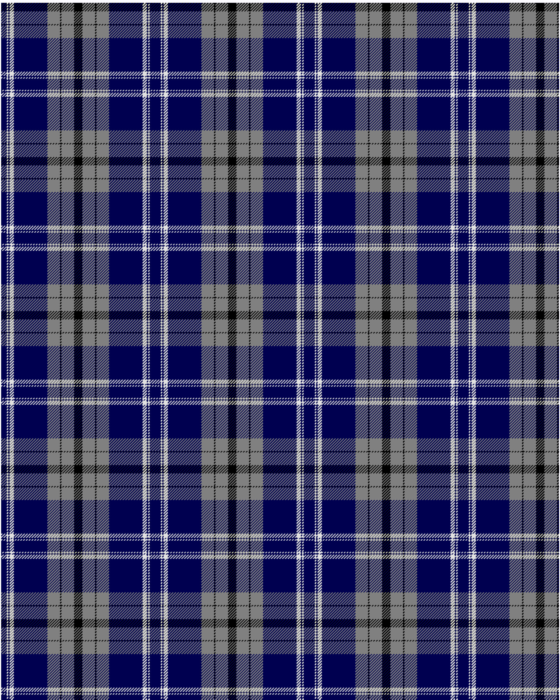

Historic Scotland

This was sourced from <no value>.  It is a 9 stripes tartan.

Original link http://www.weddslist.com/cgi-bin/tartans/pg.pl?source=sts

## Thread count
DB/8 LN2 DB2 LN6 DB48 N18 K2 N18 K/6

## Palette
DB#000050 K#000000 LN#E0E0E0 N#808080

# Sample pattern

ID: /variants/db/8/ln2/db2/ln6/db48/n18/k2/n18/k/6-db000050-k000000-lne0e0e0-n808080