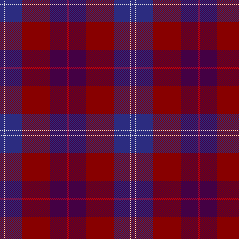

The parent of this is [Sail Chalmadale (Fashion)](/tartans/db/8/ln2/db34/dr56/dp34/r/4/)

This was sourced from tartans-authority.  It is a [6 stripes tartan](/stripes/stripes6/).

Original link http://www.tartansauthority.com/tartan-ferret/display/7217/

## Thread count
DB/8 LN2 DB34 DR56 DP34 R/4

## Palette
Each colour and its ΔE from the base-6 reference it is a variant of.

| Colour | Shade | Base | ΔE (OKLab) |
|---|---|---|---|
| DB |  `#2C2C80` | B  | 0.05 |
| DP |  `#440044` | B  | 0.17 |
| DR |  `#880000` | R  | 0.14 |
| LN |  `#E0E0E0` | W  | 0.06 |
| R |  `#B00024` | R  | 0.06 |

# Sample pattern

ID: /variants/db/8/ln2/db34/dr56/dp34/r/4-db2c2c80-dp440044-dr880000-lne0e0e0-rb00024/
