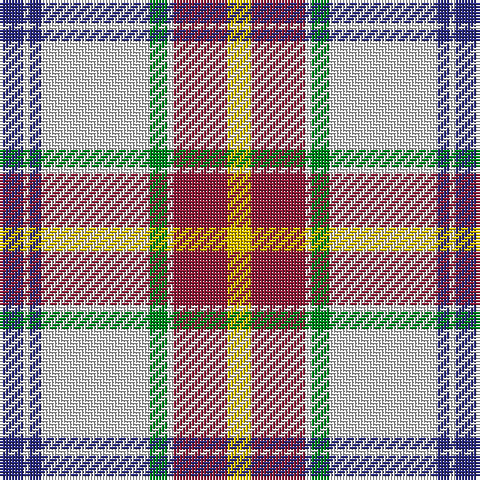

The parent of this is [Manitoba Dress (1958) (District)](/tartans/db/8/ln2/db4/ln36/g6/ln2/dr18/y/8/)

This was sourced from tartans-authority.  It is a [8 stripes tartan](/stripes/stripes8/).

Original link http://www.tartansauthority.com/tartan-ferret/display/7697/

## Thread count
DB/8 LN2 DB4 LN36 G6 LN2 DR18 Y/8

## Palette
Each colour and its ΔE from the base-6 reference it is a variant of.

| Colour | Shade | Base | ΔE (OKLab) |
|---|---|---|---|
| DB |  `#2C2C80` | B  | 0.05 |
| DR |  `#901C38` | R  | 0.12 |
| G |  `#00881C` | G  | 0.11 |
| LN |  `#E0E0E0` | W  | 0.06 |
| Y |  `#E8C000` | Y  | 0.00 |

# Sample pattern

ID: /variants/db/8/ln2/db4/ln36/g6/ln2/dr18/y/8-db2c2c80-dr901c38-g00881c-lne0e0e0-ye8c000/
