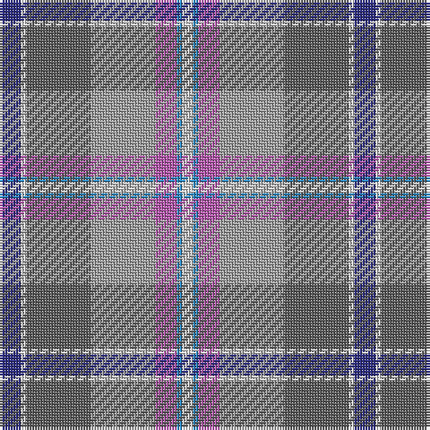

The parent of this is [Ontex](/tartans/db/8/ln2/n24/na24/p8/b2/ln/4/)

This was sourced from register-of-tartans.  It is a [7 stripes tartan](/stripes/stripes7/).

Original link https://www.tartanregister.gov.uk/tartanDetails.aspx?ref=11358

## Thread count
DB/8 LN2 N24 Na24 P8 B2 LN/4

## Palette
Each colour and its ΔE from the base-6 reference it is a variant of.

| Colour | Shade | Base | ΔE (OKLab) |
|---|---|---|---|
| B |  `#2888C4` | B  | 0.21 |
| DB |  `#2C2C80` | B  | 0.05 |
| LN |  `#E0E0E0` | W  | 0.06 |
| N |  `#5C5C5C` | B  | 0.14 |
| Na |  `#A0A0A0` | Y  | 0.20 |
| P |  `#B458AC` | R  | 0.20 |

# Sample pattern

ID: /variants/db/8/ln2/n24/na24/p8/b2/ln/4-b2888c4-db2c2c80-lne0e0e0-n5c5c5c-naa0a0a0-pb458ac/
