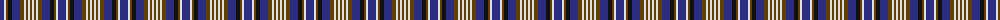

The parent of this is [City of Pointe-Claire (District)](/tartans/db/8/ln2/t2/k4/db8/t4/ln2/t2/ln2/t/2/)

This was sourced from tartans-authority.  It is a [10 stripes tartan](/stripes/stripes10/).

Original link http://www.tartansauthority.com/tartan-ferret/display/10509/

## Thread count
DB/8 LN2 T2 K4 DB8 T4 LN2 T2 LN2 T/2

## Palette
Each colour and its ΔE from the base-6 reference it is a variant of.

| Colour | Shade | Base | ΔE (OKLab) |
|---|---|---|---|
| DB |  `#2C2C80` | B  | 0.05 |
| K |  `#101010` | K  | 0.17 |
| LN |  `#E0E0E0` | W  | 0.06 |
| T |  `#604000` | G  | 0.14 |

ID: /variants/db/8/ln2/t2/k4/db8/t4/ln2/t2/ln2/t/2-db2c2c80-k101010-lne0e0e0-t604000/
