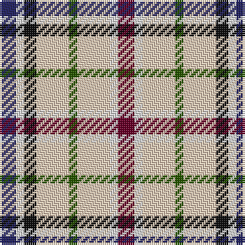

The parent of this is [Desang](/tartans/db/8/ln4/k6/lr16/g4/lr16/ln4/dr/8/)

This was sourced from register-of-tartans.  It is a [8 stripes tartan](/stripes/stripes8/).

Original link https://www.tartanregister.gov.uk/tartanDetails.aspx?ref=917

## Thread count
DB/8 LN4 K6 LR16 G4 LR16 LN4 DR/8

## Palette
Each colour and its ΔE from the base-6 reference it is a variant of.

| Colour | Shade | Base | ΔE (OKLab) |
|---|---|---|---|
| DB |  `#202060` | B  | 0.11 |
| DR |  `#680028` | B  | 0.20 |
| G |  `#285800` | G  | 0.04 |
| K |  `#101010` | K  | 0.17 |
| LN |  `#E0E0E0` | W  | 0.06 |
| LR |  `#E8CCB8` | W  | 0.11 |

# Sample pattern

ID: /variants/db/8/ln4/k6/lr16/g4/lr16/ln4/dr/8-db202060-dr680028-g285800-k101010-lne0e0e0-lre8ccb8/
