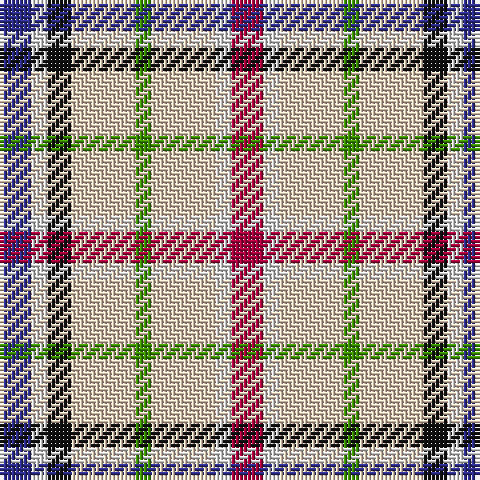

The parent of this is [Desang (Corporate)](/tartans/db/8/ln4/k6/lr16/g4/lr16/ln4/r/8/)

This was sourced from tartans-authority.  It is a [8 stripes tartan](/stripes/stripes8/).

Original link http://www.tartansauthority.com/tartan-ferret/display/4028/

## Thread count
DB/8 LN4 K6 LR16 G4 LR16 LN4 R/8

## Palette
Each colour and its ΔE from the base-6 reference it is a variant of.

| Colour | Shade | Base | ΔE (OKLab) |
|---|---|---|---|
| DB |  `#2C2C88` | B  | 0.05 |
| G |  `#3C9000` | G  | 0.15 |
| K |  `#101010` | K  | 0.17 |
| LN |  `#E0E0E0` | W  | 0.06 |
| LR |  `#E8CCB8` | W  | 0.11 |
| R |  `#A8003C` | R  | 0.09 |

# Sample pattern

ID: /variants/db/8/ln4/k6/lr16/g4/lr16/ln4/r/8-db2c2c88-g3c9000-k101010-lne0e0e0-lre8ccb8-ra8003c/
