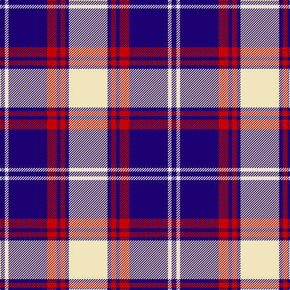

The parent of this is [Clemens and August (Personal)](/tartans/db/8/ln6/db64/r16/db6/r8/db6/w/64/)

This was sourced from tartans-authority.  It is a [8 stripes tartan](/stripes/stripes8/).

Original link http://www.tartansauthority.com/tartan-ferret/display/7827/

## Thread count
DB/8 LN6 DB64 R16 DB6 R8 DB6 W/64

## Palette
Each colour and its ΔE from the base-6 reference it is a variant of.

| Colour | Shade | Base | ΔE (OKLab) |
|---|---|---|---|
| DB |  `#1C0070` | B  | 0.14 |
| LN |  `#E0E0E0` | W  | 0.06 |
| R |  `#C80000` | R  | 0.00 |
| W |  `#F0E4BC` | W  | 0.07 |

# Sample pattern

ID: /variants/db/8/ln6/db64/r16/db6/r8/db6/w/64-db1c0070-lne0e0e0-rc80000-wf0e4bc/
