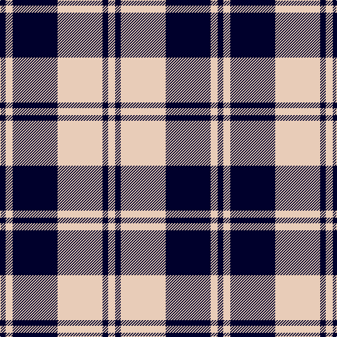

The parent of this is [Valley Forge (Artefact)](/tartans/db/8/lr10/db64/lr64/db8/lr/10/)

This was sourced from tartans-authority.  It is a [6 stripes tartan](/stripes/stripes6/).

Original link http://www.tartansauthority.com/tartan-ferret/display/8681/

## Thread count
DB/8 LR10 DB64 LR64 DB8 LR/10

## Palette
Each colour and its ΔE from the base-6 reference it is a variant of.

| Colour | Shade | Base | ΔE (OKLab) |
|---|---|---|---|
| DB |  `#00002C` | K  | 0.16 |
| LR |  `#E8CCB8` | W  | 0.11 |

# Sample pattern

ID: /variants/db/8/lr10/db64/lr64/db8/lr/10-db00002c-lre8ccb8/
