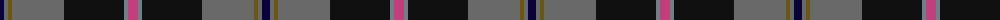

The parent of this is [Milne-Murtagh (2009)](/tartans/db/8/na4/g4/na52/k60/n4/p/10/)

This was sourced from register-of-tartans.  It is a [7 stripes tartan](/stripes/stripes7/).

Original link https://www.tartanregister.gov.uk/tartanDetails.aspx?ref=10066

## Thread count
DB/8 Na4 G4 Na52 K60 N4 P/10

## Palette
Each colour and its ΔE from the base-6 reference it is a variant of.

| Colour | Shade | Base | ΔE (OKLab) |
|---|---|---|---|
| DB |  `#08033B` | K  | 0.20 |
| G |  `#6B5613` | G  | 0.12 |
| K |  `#101010` | K  | 0.17 |
| N |  `#6E7F86` | G  | 0.21 |
| Na |  `#696969` | G  | 0.17 |
| P |  `#C33F7B` | R  | 0.13 |

# Sample pattern

ID: /variants/db/8/na4/g4/na52/k60/n4/p/10-db08033b-g6b5613-k101010-n6e7f86-na696969-pc33f7b/
