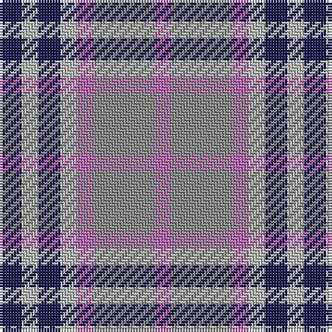

The parent of this is [Stevens #2](/tartans/db/8/na6/db8/na6/p6/n22/p/6/)

This was sourced from register-of-tartans.  It is a [7 stripes tartan](/stripes/stripes7/).

Original link https://www.tartanregister.gov.uk/tartanDetails.aspx?ref=3921

## Thread count
DB/8 Na6 DB8 Na6 P6 N22 P/6

## Palette
Each colour and its ΔE from the base-6 reference it is a variant of.

| Colour | Shade | Base | ΔE (OKLab) |
|---|---|---|---|
| DB |  `#1C1C50` | B  | 0.14 |
| N |  `#888888` | R  | 0.24 |
| Na |  `#B8B8B8` | Y  | 0.17 |
| P |  `#B468AC` | R  | 0.21 |

# Sample pattern

ID: /variants/db/8/na6/db8/na6/p6/n22/p/6-db1c1c50-n888888-nab8b8b8-pb468ac/
