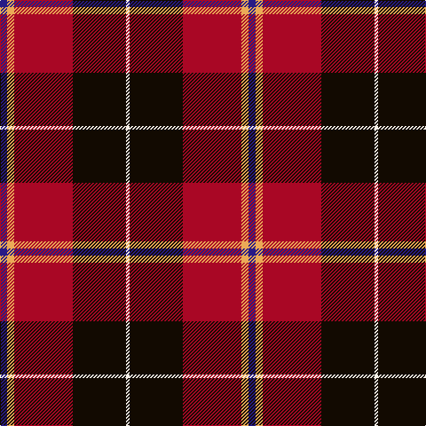

The parent of this is [Wormeck (2013) German Name Tartan Tartan Number: 10714. Earliest known date: 11 October 2012 This tartan was created by the designer for his wedding and for all those with the surname Wormeck who wish to wear it. The colours are taken from the national and regional flags of Germany and former Prussia, the province of Schleswig-Holstein, Scotland, the Czech Republic and Sweden, all places significant to the designer and his family. See products available Copyright © Blair Urquhart, Comrie, 2015](/tartans/db/8/o8/dr66/k60/w/4/)

This was sourced from house-of-tartan.  It is a [5 stripes tartan](/stripes/stripes5/).

Original link http://www.house-of-tartan.scotland.net/house/TartanViewjs.asp?colr=Def&tnam=10714

## Thread count
DB/8 O8 DR66 K60 W/4

## Palette
Each colour and its ΔE from the base-6 reference it is a variant of.

| Colour | Shade | Base | ΔE (OKLab) |
|---|---|---|---|
| DB |  `#271B86` | B  | 0.09 |
| DR |  `#A90725` | R  | 0.07 |
| K |  `#120A01` | K  | 0.15 |
| O |  `#EBAA57` | Y  | 0.08 |
| W |  `#F7F1E8` | W  | 0.01 |

# Sample pattern

ID: /variants/db/8/o8/dr66/k60/w/4-db271b86-dra90725-k120a01-oebaa57-wf7f1e8/
