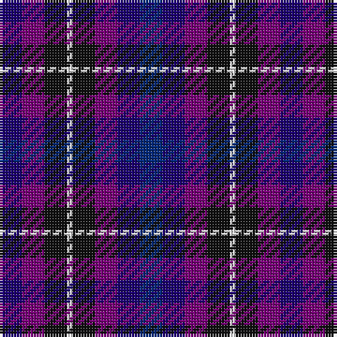

The parent of this is [Weston Family Tartan Tartan Number: 5777. Earliest known date: Feb 2002 For their wedding. See products available Copyright © Blair Urquhart, Comrie, 2015](/tartans/db/8/p8/k8/ln2/k8/p8/db8/dba/8/)

This was sourced from house-of-tartan.  It is a [8 stripes tartan](/stripes/stripes8/).

Original link http://www.house-of-tartan.scotland.net/house/TartanViewjs.asp?colr=Def&tnam=5777

## Thread count
DB/8 P8 K8 LN2 K8 P8 DB8 DBa/8

## Palette
Each colour and its ΔE from the base-6 reference it is a variant of.

| Colour | Shade | Base | ΔE (OKLab) |
|---|---|---|---|
| DB |  `#1C0070` | B  | 0.14 |
| DBa |  `#002878` | B  | 0.09 |
| DBb |  `#202060` | B  | 0.11 |
| DN |  `#14283C` | B  | 0.14 |
| K |  `#101010` | K  | 0.17 |
| LN |  `#E0E0E0` | W  | 0.06 |
| P |  `#780078` | B  | 0.16 |

# Sample pattern

ID: /variants/db/8/p8/k8/ln2/k8/p8/db8/dba/8-db1c0070-dba002878-dbb202060-dn14283c-k101010-lne0e0e0-p780078/
