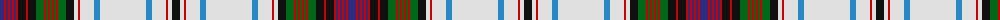

The parent of this is [MacDonald Dress Clan Tartan Tartan Number: 2001. Earliest known date: pre 2003 Estimated count See products available Copyright © Blair Urquhart, Comrie, 2015](/tartans/db/8/r2/db2/r2/db2/r2/db2/r2/k8/r2/k8/g8/r2/g2/r2/g2/r2/g2/r2/g8/k8/ln4/r2/ln14/b6/ln46/b6/ln14/r2/ln4/k/8/)

This was sourced from house-of-tartan.  It is a [31 stripes tartan](/stripes/stripes31/).

Original link http://www.house-of-tartan.scotland.net/house/TartanViewjs.asp?colr=Def&tnam=2001

## Thread count
DB/8 R2 DB2 R2 DB2 R2 DB2 R2 K8 R2 K8 G8 R2 G2 R2 G2 R2 G2 R2 G8 K8 LN4 R2 LN14 B6 LN46 B6 LN14 R2 LN4 K/8

## Palette
Each colour and its ΔE from the base-6 reference it is a variant of.

| Colour | Shade | Base | ΔE (OKLab) |
|---|---|---|---|
| B |  `#2888C4` | B  | 0.21 |
| DB |  `#2C2C80` | B  | 0.05 |
| G |  `#006818` | G  | 0.02 |
| K |  `#101010` | K  | 0.17 |
| LN |  `#E0E0E0` | W  | 0.06 |
| R |  `#C80000` | R  | 0.00 |

ID: /variants/db/8/r2/db2/r2/db2/r2/db2/r2/k8/r2/k8/g8/r2/g2/r2/g2/r2/g2/r2/g8/k8/ln4/r2/ln14/b6/ln46/b6/ln14/r2/ln4/k/8-b2888c4-db2c2c80-g006818-k101010-lne0e0e0-rc80000/
