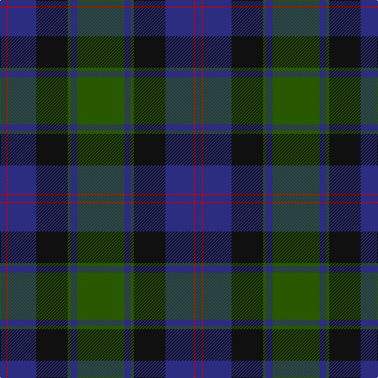

The parent of this is [MacTaggart (Clan)](/tartans/db/8/r2/db36/k40/g4/db8/g/60/)

This was sourced from tartans-authority.  It is a [7 stripes tartan](/stripes/stripes7/).

Original link http://www.tartansauthority.com/tartan-ferret/display/409/

## Thread count
DB/8 R2 DB36 K40 G4 DB8 G/60

## Palette
Each colour and its ΔE from the base-6 reference it is a variant of.

| Colour | Shade | Base | ΔE (OKLab) |
|---|---|---|---|
| DB |  `#2C2C80` | B  | 0.05 |
| G |  `#285800` | G  | 0.04 |
| K |  `#101010` | K  | 0.17 |
| R |  `#C80000` | R  | 0.00 |

# Sample pattern

ID: /variants/db/8/r2/db36/k40/g4/db8/g/60-db2c2c80-g285800-k101010-rc80000/
