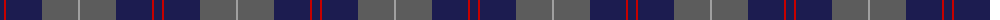
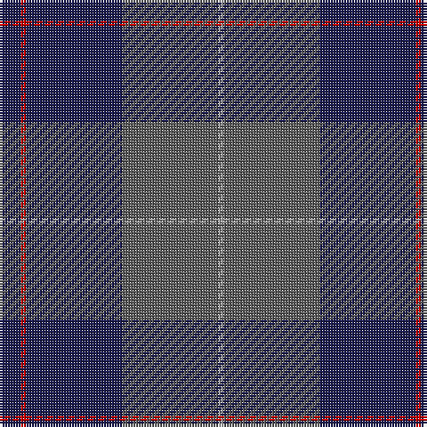

The parent of this is [Ardee (Corporate)](/tartans/db/8/r2/db36/n36/na/2/)

This was sourced from tartans-authority.  It is a [5 stripes tartan](/stripes/stripes5/).

Original link http://www.tartansauthority.com/tartan-ferret/display/8051/

## Thread count
DB/8 R2 DB36 N36 Na/2

## Palette
Each colour and its ΔE from the base-6 reference it is a variant of.

| Colour | Shade | Base | ΔE (OKLab) |
|---|---|---|---|
| DB |  `#1C1C50` | B  | 0.14 |
| N |  `#5C5C5C` | B  | 0.14 |
| Na |  `#A0A0A0` | Y  | 0.20 |
| R |  `#C80000` | R  | 0.00 |

# Sample pattern

ID: /variants/db/8/r2/db36/n36/na/2-db1c1c50-n5c5c5c-naa0a0a0-rc80000/
