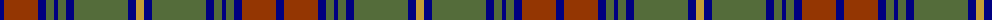

The parent of this is [Cape Breton University Chemistry Society](/tartans/db/8/r34/db8/g8/db4/g8/db8/g54/db8/o/8/)

This was sourced from register-of-tartans.  It is a [10 stripes tartan](/stripes/stripes10/).

Original link https://www.tartanregister.gov.uk/tartanDetails.aspx?ref=10629

## Thread count
DB/8 R34 DB8 G8 DB4 G8 DB8 G54 DB8 O/8

## Palette
Each colour and its ΔE from the base-6 reference it is a variant of.

| Colour | Shade | Base | ΔE (OKLab) |
|---|---|---|---|
| DB |  `#000080` | B  | 0.14 |
| G |  `#546C3A` | G  | 0.10 |
| O |  `#C49D38` | Y  | 0.11 |
| R |  `#943602` | R  | 0.11 |

ID: /variants/db/8/r34/db8/g8/db4/g8/db8/g54/db8/o/8-db000080-g546c3a-oc49d38-r943602/
