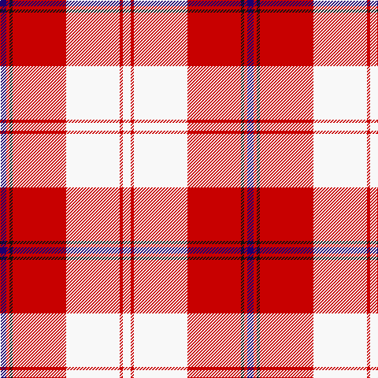

The parent of this is [Cunningham Dress (Dance)](/tartans/db/8/r4/k4/r68/w68/r4/w/10/)

This was sourced from tartans-authority.  It is a [7 stripes tartan](/stripes/stripes7/).

Original link http://www.tartansauthority.com/tartan-ferret/display/563/

## Thread count
DB/8 R4 K4 R68 W68 R4 W/10

## Palette
Each colour and its ΔE from the base-6 reference it is a variant of.

| Colour | Shade | Base | ΔE (OKLab) |
|---|---|---|---|
| DB |  `#1C0070` | B  | 0.14 |
| K |  `#101010` | K  | 0.17 |
| R |  `#C80000` | R  | 0.00 |
| W |  `#F8F8F8` | W  | 0.01 |

# Sample pattern

ID: /variants/db/8/r4/k4/r68/w68/r4/w/10-db1c0070-k101010-rc80000-wf8f8f8/
