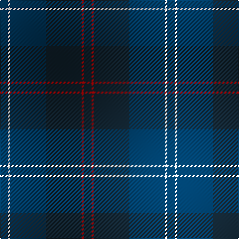

The parent of this is [Ewell Castle School](/tartans/db/8/w2/db36/dn36/r2/dn/8/)

This was sourced from register-of-tartans.  It is a [6 stripes tartan](/stripes/stripes6/).

Original link https://www.tartanregister.gov.uk/tartanDetails.aspx?ref=11288

## Thread count
DB/8 W2 DB36 DN36 R2 DN/8

## Palette
Each colour and its ΔE from the base-6 reference it is a variant of.

| Colour | Shade | Base | ΔE (OKLab) |
|---|---|---|---|
| DB |  `#003C64` | B  | 0.07 |
| DN |  `#142836` | B  | 0.15 |
| R |  `#FF0000` | R  | 0.11 |
| W |  `#FFFFFF` | W  | 0.03 |

# Sample pattern

ID: /variants/db/8/w2/db36/dn36/r2/dn/8-db003c64-dn142836-rff0000-wffffff/
