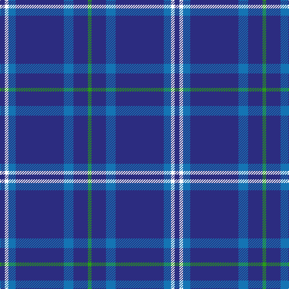

The parent of this is [JetBlue (Corporate)](/tartans/db/8/w6/b12/db80/b16/db24/g/6/)

This was sourced from tartans-authority.  It is a [7 stripes tartan](/stripes/stripes7/).

Original link http://www.tartansauthority.com/tartan-ferret/display/8900/

## Thread count
DB/8 W6 B12 DB80 B16 DB24 G/6

## Palette
Each colour and its ΔE from the base-6 reference it is a variant of.

| Colour | Shade | Base | ΔE (OKLab) |
|---|---|---|---|
| B |  `#1474B4` | B  | 0.15 |
| DB |  `#2C2C80` | B  | 0.05 |
| G |  `#289C18` | G  | 0.18 |
| W |  `#FCFCFC` | W  | 0.03 |

# Sample pattern

ID: /variants/db/8/w6/b12/db80/b16/db24/g/6-b1474b4-db2c2c80-g289c18-wfcfcfc/
