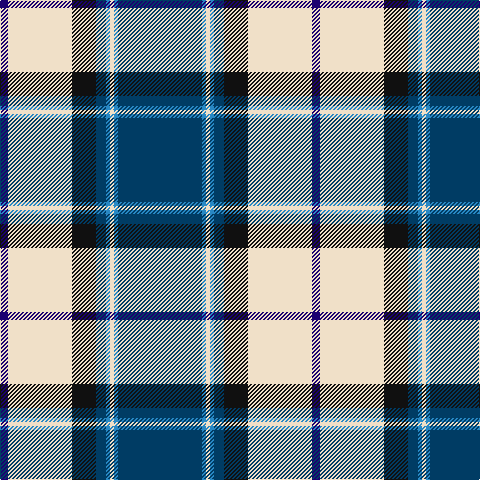

The parent of this is [Comrie, Navy Blue (Dance)](/tartans/db/8/w64/k24/dba10/b4/w4/b4/dba/84/)

This was sourced from tartans-authority.  It is a [8 stripes tartan](/stripes/stripes8/).

Original link http://www.tartansauthority.com/tartan-ferret/display/7593/

## Thread count
DB/8 W64 K24 DBa10 B4 W4 B4 DBa/84

## Palette
Each colour and its ΔE from the base-6 reference it is a variant of.

| Colour | Shade | Base | ΔE (OKLab) |
|---|---|---|---|
| B |  `#2888C4` | B  | 0.21 |
| DB |  `#1C0070` | B  | 0.14 |
| DBa |  `#003C64` | B  | 0.07 |
| K |  `#101010` | K  | 0.17 |
| W |  `#F0E0C8` | W  | 0.06 |

# Sample pattern

ID: /variants/db/8/w64/k24/dba10/b4/w4/b4/dba/84-b2888c4-db1c0070-dba003c64-k101010-wf0e0c8/
