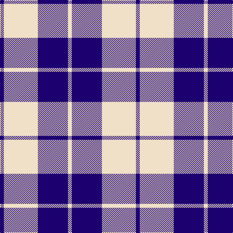

The parent of this is [Lewis, Navy (Dance)](/tartans/db/8/w70/db62/w/8/)

This was sourced from tartans-authority.  It is a [4 stripes tartan](/stripes/stripes4/).

Original link http://www.tartansauthority.com/tartan-ferret/display/7590/

## Thread count
DB/8 W70 DB62 W/8

## Palette
Each colour and its ΔE from the base-6 reference it is a variant of.

| Colour | Shade | Base | ΔE (OKLab) |
|---|---|---|---|
| DB |  `#1C0070` | B  | 0.14 |
| W |  `#F0E0C8` | W  | 0.06 |

# Sample pattern

ID: /variants/db/8/w70/db62/w/8-db1c0070-wf0e0c8/
