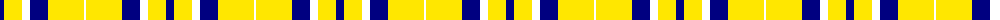

The parent of this is [WVU Mountaineer Tartan](/tartans/db/8/y18/w8/db18/y36/w/2/)

This was sourced from register-of-tartans.  It is a [6 stripes tartan](/stripes/stripes6/).

Original link https://www.tartanregister.gov.uk/tartanDetails.aspx?ref=10567

## Thread count
DB/8 Y18 W8 DB18 Y36 W/2

## Palette
Each colour and its ΔE from the base-6 reference it is a variant of.

| Colour | Shade | Base | ΔE (OKLab) |
|---|---|---|---|
| DB |  `#000080` | B  | 0.14 |
| W |  `#FFFFFF` | W  | 0.03 |
| Y |  `#FFE700` | Y  | 0.11 |

# Sample pattern

ID: /variants/db/8/y18/w8/db18/y36/w/2-db000080-wffffff-yffe700/
