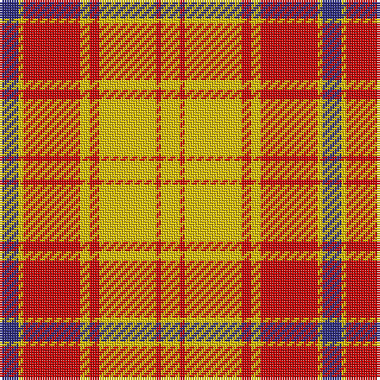

The parent of this is [Glassary #3](/tartans/db/8/y2/r24/y4/r4/y24/r2/y/8/)

This was sourced from register-of-tartans.  It is a [8 stripes tartan](/stripes/stripes8/).

Original link https://www.tartanregister.gov.uk/tartanDetails.aspx?ref=1363

## Thread count
DB/8 Y2 R24 Y4 R4 Y24 R2 Y/8

## Palette
Each colour and its ΔE from the base-6 reference it is a variant of.

| Colour | Shade | Base | ΔE (OKLab) |
|---|---|---|---|
| DB |  `#2C2C80` | B  | 0.05 |
| R |  `#C80000` | R  | 0.00 |
| Y |  `#E8C000` | Y  | 0.00 |

# Sample pattern

ID: /variants/db/8/y2/r24/y4/r4/y24/r2/y/8-db2c2c80-rc80000-ye8c000/
