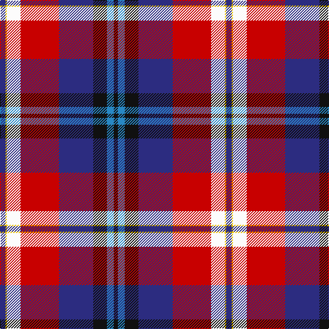

The parent of this is [McKnight Dress (Personal)](/tartans/db/8/y2/w20/r56/db50/k20/b10/k/6/)

This was sourced from tartans-authority.  It is a [8 stripes tartan](/stripes/stripes8/).

Original link http://www.tartansauthority.com/tartan-ferret/display/6214/

## Thread count
DB/8 Y2 W20 R56 DB50 K20 B10 K/6

## Palette
Each colour and its ΔE from the base-6 reference it is a variant of.

| Colour | Shade | Base | ΔE (OKLab) |
|---|---|---|---|
| B |  `#2888C4` | B  | 0.21 |
| DB |  `#2C2C80` | B  | 0.05 |
| K |  `#101010` | K  | 0.17 |
| R |  `#C80000` | R  | 0.00 |
| W |  `#FCFCFC` | W  | 0.03 |
| Y |  `#E8C000` | Y  | 0.00 |

# Sample pattern

ID: /variants/db/8/y2/w20/r56/db50/k20/b10/k/6-b2888c4-db2c2c80-k101010-rc80000-wfcfcfc-ye8c000/
