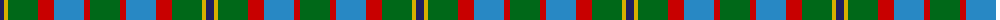
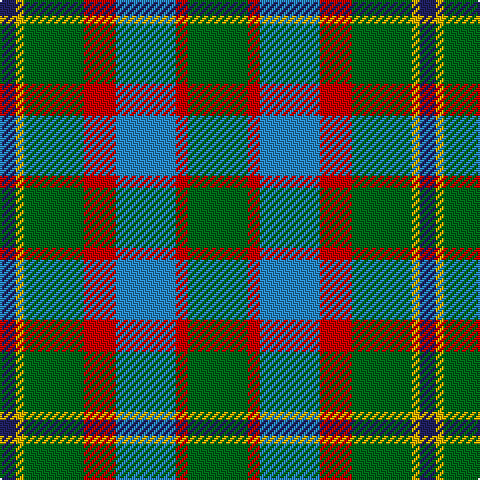

The parent of this is [Rotary International (Corporate)](/tartans/db/8/y4/g30/r16/b30/r6/g/30/)

This was sourced from tartans-authority.  It is a [7 stripes tartan](/stripes/stripes7/).

Original link http://www.tartansauthority.com/tartan-ferret/display/2334/

## Thread count
DB/8 Y4 G30 R16 B30 R6 G/30

## Palette
Each colour and its ΔE from the base-6 reference it is a variant of.

| Colour | Shade | Base | ΔE (OKLab) |
|---|---|---|---|
| B |  `#2888C4` | B  | 0.21 |
| DB |  `#202060` | B  | 0.11 |
| G |  `#006818` | G  | 0.02 |
| R |  `#C80000` | R  | 0.00 |
| Y |  `#D8B000` | Y  | 0.05 |

# Sample pattern

ID: /variants/db/8/y4/g30/r16/b30/r6/g/30-b2888c4-db202060-g006818-rc80000-yd8b000/
