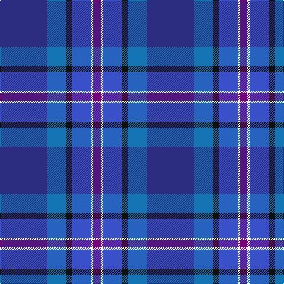

The parent of this is [MacFarland-Collins (Name)](/tartans/db/80/ba32/k10/b32/w4/p/12/)

This was sourced from tartans-authority.  It is a [6 stripes tartan](/stripes/stripes6/).

Original link http://www.tartansauthority.com/tartan-ferret/display/10344/

## Thread count
DB/80 Ba32 K10 B32 W4 P/12

## Palette
Each colour and its ΔE from the base-6 reference it is a variant of.

| Colour | Shade | Base | ΔE (OKLab) |
|---|---|---|---|
| B |  `#3850C8` | B  | 0.12 |
| Ba |  `#1474B4` | B  | 0.15 |
| DB |  `#2C2C80` | B  | 0.05 |
| K |  `#101010` | K  | 0.17 |
| P |  `#780078` | B  | 0.16 |
| W |  `#FCFCFC` | W  | 0.03 |

# Sample pattern

ID: /variants/db/80/ba32/k10/b32/w4/p/12-b3850c8-ba1474b4-db2c2c80-k101010-p780078-wfcfcfc/
