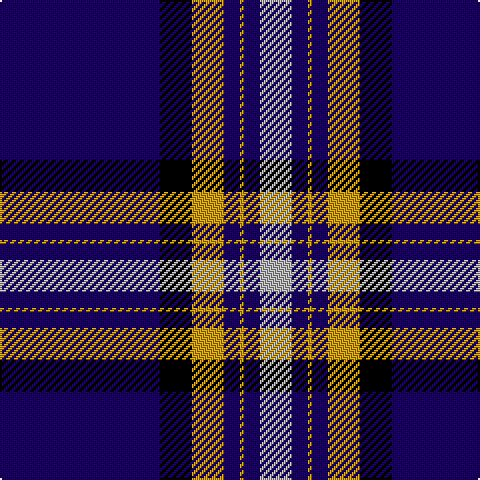

The parent of this is [Wcwm 4907-2](/tartans/db/80/k16/dy16/db8/dy2/db8/n/16/)

This was sourced from register-of-tartans.  It is a [7 stripes tartan](/stripes/stripes7/).

Original link https://www.tartanregister.gov.uk/tartanDetails.aspx?ref=4550

## Thread count
DB/80 K16 DY16 DB8 DY2 DB8 N/16

## Palette
Each colour and its ΔE from the base-6 reference it is a variant of.

| Colour | Shade | Base | ΔE (OKLab) |
|---|---|---|---|
| DB |  `#180064` | B  | 0.16 |
| DY |  `#C89800` | Y  | 0.12 |
| K |  `#000000` | K  | 0.00 |
| N |  `#B0B0B0` | Y  | 0.18 |

# Sample pattern

ID: /variants/db/80/k16/dy16/db8/dy2/db8/n/16-db180064-dyc89800-k000000-nb0b0b0/
