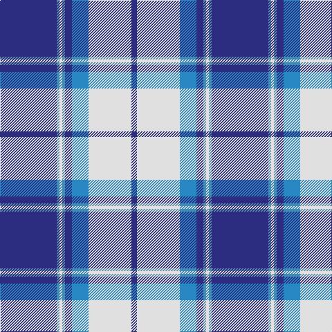

The parent of this is [Harmony Eildon (Dance)](/tartans/db/82/b4/ln4/b4/db10/ba24/ln62/db/8/)

This was sourced from tartans-authority.  It is a [8 stripes tartan](/stripes/stripes8/).

Original link http://www.tartansauthority.com/tartan-ferret/display/87/

## Thread count
DB/82 B4 LN4 B4 DB10 Ba24 LN62 DB/8

## Palette
Each colour and its ΔE from the base-6 reference it is a variant of.

| Colour | Shade | Base | ΔE (OKLab) |
|---|---|---|---|
| B |  `#5C8CA8` | B  | 0.23 |
| Ba |  `#2888C4` | B  | 0.21 |
| DB |  `#2C2C80` | B  | 0.05 |
| LN |  `#E0E0E0` | W  | 0.06 |

# Sample pattern

ID: /variants/db/82/b4/ln4/b4/db10/ba24/ln62/db/8-b5c8ca8-ba2888c4-db2c2c80-lne0e0e0/
