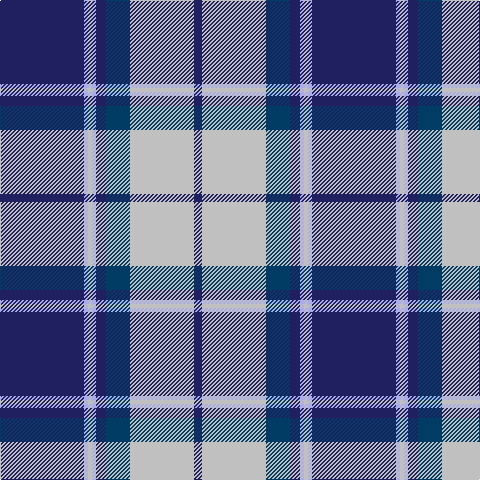

The parent of this is [Longniddry Eildon Blue Dress Fancy Tartan Tartan Number: 5486. Earliest known date: pre 1992 Dancers tartan See products available Copyright © Blair Urquhart, Comrie, 2015](/tartans/db/84/lp4/n4/lp4/db10/dba24/n64/db/8/)

This was sourced from house-of-tartan.  It is a [8 stripes tartan](/stripes/stripes8/).

Original link http://www.house-of-tartan.scotland.net/house/TartanViewjs.asp?colr=Def&tnam=5486

## Thread count
DB/84 LP4 N4 LP4 DB10 DBa24 N64 DB/8

## Palette
Each colour and its ΔE from the base-6 reference it is a variant of.

| Colour | Shade | Base | ΔE (OKLab) |
|---|---|---|---|
| DB |  `#202060` | B  | 0.11 |
| DBa |  `#003C64` | B  | 0.07 |
| LP |  `#A8ACE8` | W  | 0.22 |
| N |  `#C0C0C0` | W  | 0.16 |

# Sample pattern

ID: /variants/db/84/lp4/n4/lp4/db10/dba24/n64/db/8-db202060-dba003c64-lpa8ace8-nc0c0c0/
