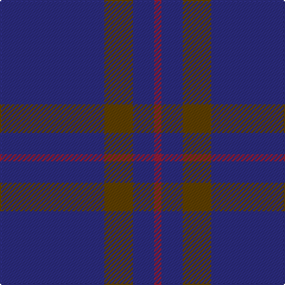

The parent of this is [Elliot (Clan)](/tartans/db/88/t24/db18/dr/6/)

This was sourced from tartans-authority.  It is a [4 stripes tartan](/stripes/stripes4/).

Original link http://www.tartansauthority.com/tartan-ferret/display/596/

## Thread count
DB/88 T24 DB18 DR/6

## Palette
Each colour and its ΔE from the base-6 reference it is a variant of.

| Colour | Shade | Base | ΔE (OKLab) |
|---|---|---|---|
| DB |  `#2C2C80` | B  | 0.05 |
| DR |  `#901C38` | R  | 0.12 |
| T |  `#604000` | G  | 0.14 |

# Sample pattern

ID: /variants/db/88/t24/db18/dr/6-db2c2c80-dr901c38-t604000/
