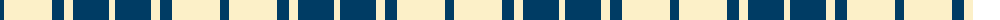

The parent of this is [MacMugen](/tartans/db/9/ly48/db12/ly9/db36/ly/6/)

This was sourced from tartans-authority.  It is a [6 stripes tartan](/stripes/stripes6/).

Original link http://www.tartansauthority.com/tartan-ferret/display/2657/

## Thread count
DB/9 LY48 DB12 LY9 DB36 LY/6

## Palette
Each colour and its ΔE from the base-6 reference it is a variant of.

| Colour | Shade | Base | ΔE (OKLab) |
|---|---|---|---|
| DB |  `#003C64` | B  | 0.07 |
| LY |  `#FCF0C8` | W  | 0.05 |

# Sample pattern

ID: /variants/db/9/ly48/db12/ly9/db36/ly/6-db003c64-lyfcf0c8/
