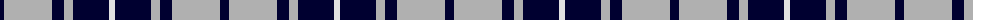
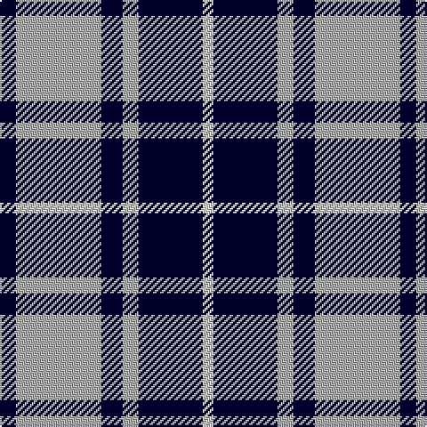

The parent of this is [MacMugen](/tartans/db/9/n48/db12/n9/db36/ln/6/)

This was sourced from weddslist.  It is a [6 stripes tartan](/stripes/stripes6/).

Original link http://www.weddslist.com/cgi-bin/tartans/pg.pl?source=sts

## Thread count
DB/9 N48 DB12 N9 DB36 LN/6

## Palette
Each colour and its ΔE from the base-6 reference it is a variant of.

| Colour | Shade | Base | ΔE (OKLab) |
|---|---|---|---|
| DB |  `#000030` | K  | 0.17 |
| LN |  `#E0E0E0` | W  | 0.06 |
| N |  `#B0B0B0` | Y  | 0.18 |

# Sample pattern

ID: /variants/db/9/n48/db12/n9/db36/ln/6-db000030-lne0e0e0-nb0b0b0/
