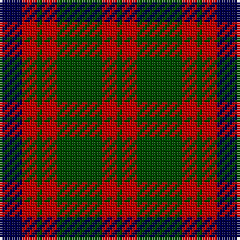

The parent of this is [Skene D](/tartans/db/9/r6/g2/r6/g18/r6/g/2/)

This was sourced from weddslist.  It is a [7 stripes tartan](/stripes/stripes7/).

Original link http://www.weddslist.com/cgi-bin/tartans/pg.pl?source=rb

## Thread count
DB/9 R6 G2 R6 G18 R6 G/2

## Palette
Each colour and its ΔE from the base-6 reference it is a variant of.

| Colour | Shade | Base | ΔE (OKLab) |
|---|---|---|---|
| DB |  `#00004C` | B  | 0.21 |
| G |  `#004C00` | G  | 0.08 |
| R |  `#C80000` | R  | 0.00 |

# Sample pattern

ID: /variants/db/9/r6/g2/r6/g18/r6/g/2-db00004c-g004c00-rc80000/
