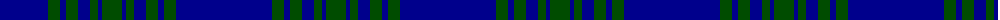

The parent of this is [Lochleven (Dance)](/tartans/db/96/g12/db6/g12/db12/g8/db4/g/20/)

This was sourced from register-of-tartans.  It is a [8 stripes tartan](/stripes/stripes8/).

Original link https://www.tartanregister.gov.uk/tartanDetails.aspx?ref=2175

## Thread count
DB/96 G12 DB6 G12 DB12 G8 DB4 G/20

## Palette
Each colour and its ΔE from the base-6 reference it is a variant of.

| Colour | Shade | Base | ΔE (OKLab) |
|---|---|---|---|
| DB |  `#00008C` | B  | 0.13 |
| G |  `#004C00` | G  | 0.08 |

# Sample pattern

ID: /variants/db/96/g12/db6/g12/db12/g8/db4/g/20-db00008c-g004c00/
