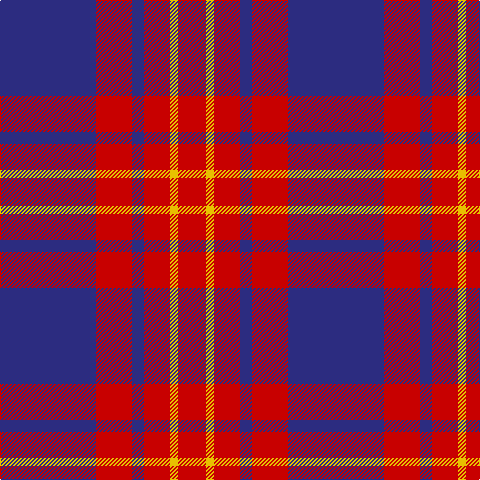

The parent of this is [Butler (Fashion)](/tartans/db/96/r36/db12/r26/y8/r/28/)

This was sourced from tartans-authority.  It is a [6 stripes tartan](/stripes/stripes6/).

Original link http://www.tartansauthority.com/tartan-ferret/display/4058/

## Thread count
DB/96 R36 DB12 R26 Y8 R/28

## Palette
Each colour and its ΔE from the base-6 reference it is a variant of.

| Colour | Shade | Base | ΔE (OKLab) |
|---|---|---|---|
| DB |  `#2C2C80` | B  | 0.05 |
| R |  `#C80000` | R  | 0.00 |
| Y |  `#E8C000` | Y  | 0.00 |

# Sample pattern

ID: /variants/db/96/r36/db12/r26/y8/r/28-db2c2c80-rc80000-ye8c000/
