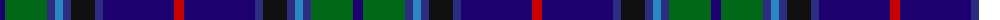

The parent of this is [Robert Burns of Ayr (Corporate)](/tartans/dba/10/g42/db8/b8/db8/k24/db8/dba71/r/10/)

This was sourced from tartans-authority.  It is a [9 stripes tartan](/stripes/stripes9/).

Original link http://www.tartansauthority.com/tartan-ferret/display/6843/

## Thread count
DBa/10 G42 DB8 B8 DB8 K24 DB8 DBa71 R/10

## Palette
Each colour and its ΔE from the base-6 reference it is a variant of.

| Colour | Shade | Base | ΔE (OKLab) |
|---|---|---|---|
| B |  `#2888C4` | B  | 0.21 |
| DB |  `#2C2C80` | B  | 0.05 |
| DBa |  `#1C0070` | B  | 0.14 |
| G |  `#006818` | G  | 0.02 |
| K |  `#101010` | K  | 0.17 |
| R |  `#C80000` | R  | 0.00 |

ID: /variants/dba/10/g42/db8/b8/db8/k24/db8/dba71/r/10-b2888c4-db2c2c80-dba1c0070-g006818-k101010-rc80000/
