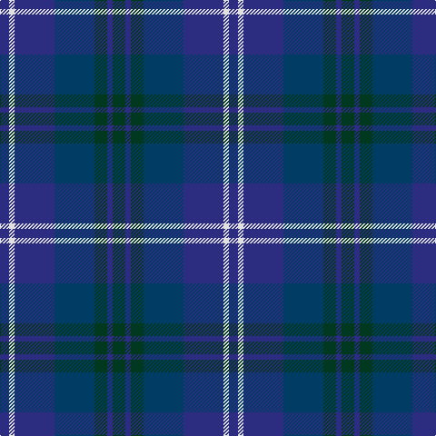

The parent of this is [United Colours of Scotland (Corporat](/tartans/dba/10/ln6/dba44/db44/dg14/dba6/dg/14/)

This was sourced from tartans-authority.  It is a [7 stripes tartan](/stripes/stripes7/).

Original link http://www.tartansauthority.com/tartan-ferret/display/6504/

## Thread count
DBa/10 LN6 DBa44 DB44 DG14 DBa6 DG/14

## Palette
Each colour and its ΔE from the base-6 reference it is a variant of.

| Colour | Shade | Base | ΔE (OKLab) |
|---|---|---|---|
| DB |  `#003C64` | B  | 0.07 |
| DBa |  `#2C2C80` | B  | 0.05 |
| DG |  `#003820` | G  | 0.16 |
| LN |  `#E0E0E0` | W  | 0.06 |

# Sample pattern

ID: /variants/dba/10/ln6/dba44/db44/dg14/dba6/dg/14-db003c64-dba2c2c80-dg003820-lne0e0e0/
