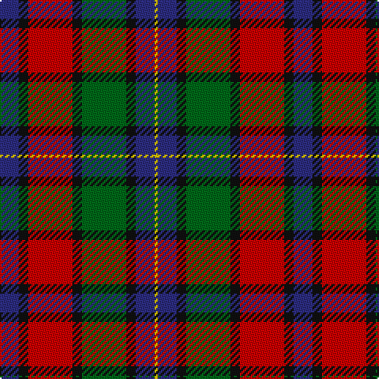

The parent of this is [Kilgour (Asymmetrical)](/tartans/dba/12/k6/r28/k6/g28/k6/dba12/y/2/)

This was sourced from register-of-tartans.  It is a [8 stripes tartan](/stripes/stripes8/).

Original link https://www.tartanregister.gov.uk/tartanDetails.aspx?ref=1968

## Thread count
DBa/12 K6 R28 K6 G28 K6 DBa12 Y/2

## Palette
Each colour and its ΔE from the base-6 reference it is a variant of.

| Colour | Shade | Base | ΔE (OKLab) |
|---|---|---|---|
| DB |  `#202060` | B  | 0.11 |
| DBa |  `#2C2C80` | B  | 0.05 |
| DG |  `#003820` | G  | 0.16 |
| G |  `#006818` | G  | 0.02 |
| K |  `#101010` | K  | 0.17 |
| R |  `#C80000` | R  | 0.00 |
| Y |  `#E8C000` | Y  | 0.00 |

# Sample pattern

ID: /variants/dba/12/k6/r28/k6/g28/k6/dba12/y/2-db202060-dba2c2c80-dg003820-g006818-k101010-rc80000-ye8c000/
