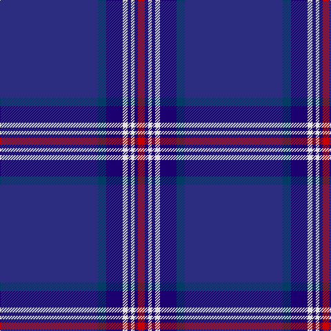

The parent of this is [Glen Innes (District)](/tartans/dba/142/db12/dbb24/ln7/dbb5/ln5/dbb5/r/10/)

This was sourced from tartans-authority.  It is a [8 stripes tartan](/stripes/stripes8/).

Original link http://www.tartansauthority.com/tartan-ferret/display/8443/

## Thread count
DBa/142 DB12 DBb24 LN7 DBb5 LN5 DBb5 R/10

## Palette
Each colour and its ΔE from the base-6 reference it is a variant of.

| Colour | Shade | Base | ΔE (OKLab) |
|---|---|---|---|
| DB |  `#003C64` | B  | 0.07 |
| DBa |  `#2C2C80` | B  | 0.05 |
| DBb |  `#1C0070` | B  | 0.14 |
| LN |  `#E0E0E0` | W  | 0.06 |
| R |  `#C80000` | R  | 0.00 |

# Sample pattern

ID: /variants/dba/142/db12/dbb24/ln7/dbb5/ln5/dbb5/r/10-db003c64-dba2c2c80-dbb1c0070-lne0e0e0-rc80000/
