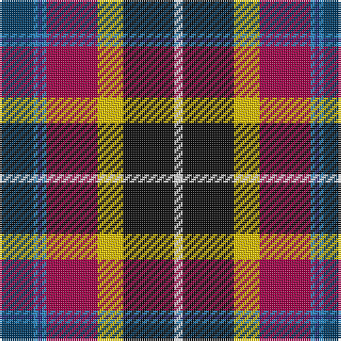

The parent of this is [Maryland (Commemorative)](/tartans/dba/16/b2/db2/b2/r24/y12/k24/ln/4/)

This was sourced from tartans-authority.  It is a [8 stripes tartan](/stripes/stripes8/).

Original link http://www.tartansauthority.com/tartan-ferret/display/5920/

## Thread count
DBa/16 B2 DB2 B2 R24 Y12 K24 LN/4

## Palette
Each colour and its ΔE from the base-6 reference it is a variant of.

| Colour | Shade | Base | ΔE (OKLab) |
|---|---|---|---|
| B |  `#2888C4` | B  | 0.21 |
| DB |  `#2C2C80` | B  | 0.05 |
| DBa |  `#003C64` | B  | 0.07 |
| K |  `#101010` | K  | 0.17 |
| LN |  `#E0E0E0` | W  | 0.06 |
| R |  `#A00048` | R  | 0.11 |
| Y |  `#E8C000` | Y  | 0.00 |

# Sample pattern

ID: /variants/dba/16/b2/db2/b2/r24/y12/k24/ln/4-b2888c4-db2c2c80-dba003c64-k101010-lne0e0e0-ra00048-ye8c000/
