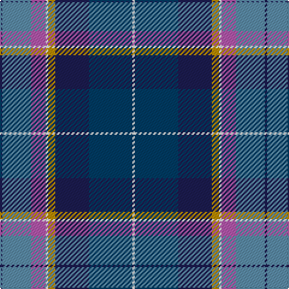

The parent of this is [Ancient Gathering](/tartans/dba/2/b24/p12/w2/dy6/dba28/db36/w/2/)

This was sourced from register-of-tartans.  It is a [8 stripes tartan](/stripes/stripes8/).

Original link https://www.tartanregister.gov.uk/tartanDetails.aspx?ref=11029

## Thread count
DBa/2 B24 P12 W2 DY6 DBa28 DB36 W/2

## Palette
Each colour and its ΔE from the base-6 reference it is a variant of.

| Colour | Shade | Base | ΔE (OKLab) |
|---|---|---|---|
| B |  `#5C8CA8` | B  | 0.23 |
| DB |  `#003C64` | B  | 0.07 |
| DBa |  `#1C1C50` | B  | 0.14 |
| DY |  `#BC8C00` | Y  | 0.16 |
| P |  `#B458AC` | R  | 0.20 |
| W |  `#FFFFFF` | W  | 0.03 |

# Sample pattern

ID: /variants/dba/2/b24/p12/w2/dy6/dba28/db36/w/2-b5c8ca8-db003c64-dba1c1c50-dybc8c00-pb458ac-wffffff/
