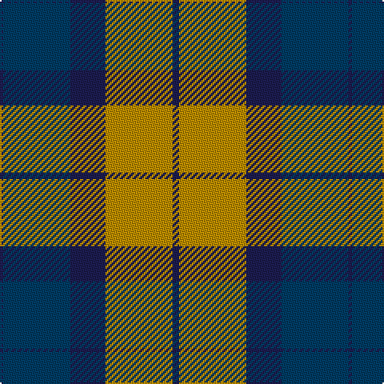

The parent of this is [St. Matthews Check (School)](/tartans/dba/2/db42/dba22/dy42/dba/4/)

This was sourced from tartans-authority.  It is a [5 stripes tartan](/stripes/stripes5/).

Original link http://www.tartansauthority.com/tartan-ferret/display/8147/

## Thread count
DBa/2 DB42 DBa22 DY42 DBa/4

## Palette
Each colour and its ΔE from the base-6 reference it is a variant of.

| Colour | Shade | Base | ΔE (OKLab) |
|---|---|---|---|
| DB |  `#003C64` | B  | 0.07 |
| DBa |  `#1C1C50` | B  | 0.14 |
| DY |  `#BC8C00` | Y  | 0.16 |

# Sample pattern

ID: /variants/dba/2/db42/dba22/dy42/dba/4-db003c64-dba1c1c50-dybc8c00/
