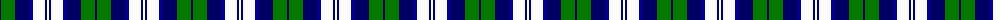
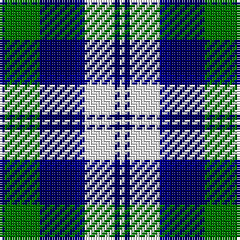

The parent of this is [Blue Boy, The (Fashion)](/tartans/dba/2/g14/dba14/db4/w12/dba2/w/2/)

This was sourced from tartans-authority.  It is a [7 stripes tartan](/stripes/stripes7/).

Original link http://www.tartansauthority.com/tartan-ferret/display/3705/

## Thread count
DBa/2 G14 DBa14 DB4 W12 DBa2 W/2

## Palette
Each colour and its ΔE from the base-6 reference it is a variant of.

| Colour | Shade | Base | ΔE (OKLab) |
|---|---|---|---|
| DB |  `#00008C` | B  | 0.13 |
| DBa |  `#000064` | B  | 0.17 |
| G |  `#007800` | G  | 0.06 |
| W |  `#FCFCFC` | W  | 0.03 |

# Sample pattern

ID: /variants/dba/2/g14/dba14/db4/w12/dba2/w/2-db00008c-dba000064-g007800-wfcfcfc/
