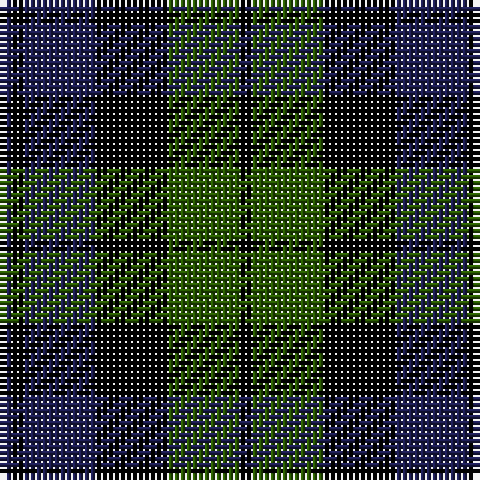

The parent of this is [Black Watch (smallest sett)](/tartans/dba/2/k2/dba12/k12/ga12/k/2/)

This was sourced from register-of-tartans.  It is a [6 stripes tartan](/stripes/stripes6/).

Original link https://www.tartanregister.gov.uk/tartanDetails.aspx?ref=5376

## Thread count
DBa/2 K2 DBa12 K12 Ga12 K/2

## Palette
Each colour and its ΔE from the base-6 reference it is a variant of.

| Colour | Shade | Base | ΔE (OKLab) |
|---|---|---|---|
| B |  `#1474B4` | B  | 0.15 |
| DB |  `#00008C` | B  | 0.13 |
| DBa |  `#1C1C50` | B  | 0.14 |
| DG |  `#003820` | G  | 0.16 |
| G |  `#007800` | G  | 0.06 |
| Ga |  `#285800` | G  | 0.04 |
| K |  `#000000` | K  | 0.00 |
| Y |  `#E8C000` | Y  | 0.00 |

# Sample pattern

ID: /variants/dba/2/k2/dba12/k12/ga12/k/2-b1474b4-db00008c-dba1c1c50-dg003820-g007800-ga285800-k000000-ye8c000/
