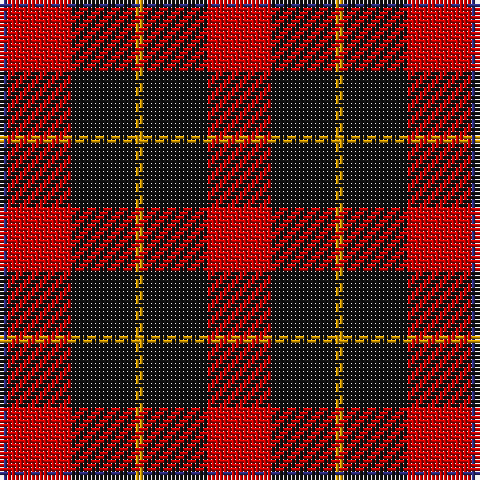

The parent of this is [Skinner Family Tartan Tartan Number: 2341. Earliest known date: 1880 circa A tartan worn by a John Skinner in 1941. He was born in Dundee 1873. His grandson (John H Beech?) wished the tartan identified and recorded. It is a Wallace variant, with a blue substituted for the black overcheck.. Safe enough now for wear by all Skinners. See products available Copyright © Blair Urquhart, Comrie, 2015](/tartans/dba/2/r16/k16/dy2/k16/r/16/)

This was sourced from house-of-tartan.  It is a [6 stripes tartan](/stripes/stripes6/).

Original link http://www.house-of-tartan.scotland.net/house/TartanViewjs.asp?colr=Def&tnam=2341

## Thread count
DBa/2 R16 K16 DY2 K16 R/16

## Palette
Each colour and its ΔE from the base-6 reference it is a variant of.

| Colour | Shade | Base | ΔE (OKLab) |
|---|---|---|---|
| DB |  `#1C0070` | B  | 0.14 |
| DBa |  `#2C2C80` | B  | 0.05 |
| DY |  `#D09800` | Y  | 0.11 |
| K |  `#101010` | K  | 0.17 |
| R |  `#C80000` | R  | 0.00 |

# Sample pattern

ID: /variants/dba/2/r16/k16/dy2/k16/r/16-db1c0070-dba2c2c80-dyd09800-k101010-rc80000/
