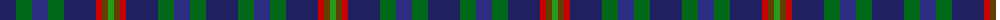
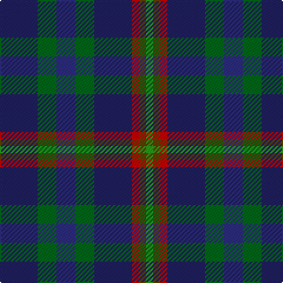

The parent of this is [Glen Erin Canadian Tartan Tartan Number: 1909. Earliest known date: pre 2003 Many new designs have been given district names to promote their Scottish connections. However, these names should not be confused with the District tartans which have earned their title through 'use and wont' and not a little history. See products available Copyright © Blair Urquhart, Comrie, 2015](/tartans/dba/32/g16/db16/g16/dba32/r6/t6/ga/6/)

This was sourced from house-of-tartan.  It is a [8 stripes tartan](/stripes/stripes8/).

Original link http://www.house-of-tartan.scotland.net/house/TartanViewjs.asp?colr=Def&tnam=1909

## Thread count
DBa/32 G16 DB16 G16 DBa32 R6 T6 Ga/6

## Palette
Each colour and its ΔE from the base-6 reference it is a variant of.

| Colour | Shade | Base | ΔE (OKLab) |
|---|---|---|---|
| DB |  `#2C2C80` | B  | 0.05 |
| DBa |  `#202060` | B  | 0.11 |
| G |  `#006818` | G  | 0.02 |
| Ga |  `#289C18` | G  | 0.18 |
| R |  `#C80000` | R  | 0.00 |
| T |  `#604000` | G  | 0.14 |

# Sample pattern

ID: /variants/dba/32/g16/db16/g16/dba32/r6/t6/ga/6-db2c2c80-dba202060-g006818-ga289c18-rc80000-t604000/
