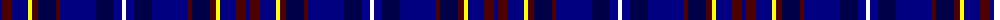

The parent of this is [Royal Gourock Yacht Club, The](/tartans/dba/4/dr10/dba16/y4/dr6/db18/dr4/dba36/db18/dbb8/w/4/)

This was sourced from register-of-tartans.  It is a [11 stripes tartan](/stripes/stripes11/).

Original link https://www.tartanregister.gov.uk/tartanDetails.aspx?ref=11087

## Thread count
DBa/4 DR10 DBa16 Y4 DR6 DB18 DR4 DBa36 DB18 DBb8 W/4

## Palette
Each colour and its ΔE from the base-6 reference it is a variant of.

| Colour | Shade | Base | ΔE (OKLab) |
|---|---|---|---|
| DB |  `#000048` | B  | 0.21 |
| DBa |  `#000080` | B  | 0.14 |
| DBb |  `#00008C` | B  | 0.13 |
| DR |  `#4C0000` | B  | 0.24 |
| W |  `#FFFFFF` | W  | 0.03 |
| Y |  `#FFFF00` | Y  | 0.16 |

ID: /variants/dba/4/dr10/dba16/y4/dr6/db18/dr4/dba36/db18/dbb8/w/4-db000048-dba000080-dbb00008c-dr4c0000-wffffff-yffff00/
