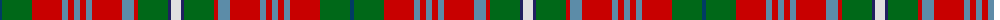

The parent of this is [MacGuire Irish Family Tartan Tartan Number: 2427. Earliest known date: 1985 MacGuire is an Irish Family tartan See products available Copyright © Blair Urquhart, Comrie, 2015](/tartans/dba/4/g30/r30/b6/r6/b6/r6/b6/r30/b12/r4/g30/db3/ln/10/)

This was sourced from house-of-tartan.  It is a [14 stripes tartan](/stripes/stripes14/).

Original link http://www.house-of-tartan.scotland.net/house/TartanViewjs.asp?colr=Def&tnam=2427

## Thread count
DBa/4 G30 R30 B6 R6 B6 R6 B6 R30 B12 R4 G30 DB3 LN/10

## Palette
Each colour and its ΔE from the base-6 reference it is a variant of.

| Colour | Shade | Base | ΔE (OKLab) |
|---|---|---|---|
| B |  `#5C8CA8` | B  | 0.23 |
| DB |  `#202060` | B  | 0.11 |
| DBa |  `#003C64` | B  | 0.07 |
| G |  `#006818` | G  | 0.02 |
| LN |  `#E0E0E0` | W  | 0.06 |
| R |  `#C80000` | R  | 0.00 |

ID: /variants/dba/4/g30/r30/b6/r6/b6/r6/b6/r30/b12/r4/g30/db3/ln/10-b5c8ca8-db202060-dba003c64-g006818-lne0e0e0-rc80000/
