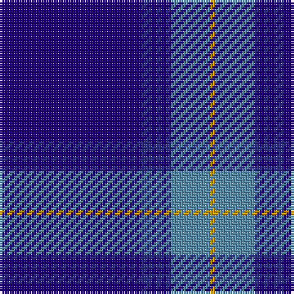

The parent of this is [Marist (Corporate)](/tartans/dba/58/db4/dba2/db2/dba2/db2/b16/dy/2/)

This was sourced from tartans-authority.  It is a [8 stripes tartan](/stripes/stripes8/).

Original link http://www.tartansauthority.com/tartan-ferret/display/2376/

## Thread count
DBa/58 DB4 DBa2 DB2 DBa2 DB2 B16 DY/2

## Palette
Each colour and its ΔE from the base-6 reference it is a variant of.

| Colour | Shade | Base | ΔE (OKLab) |
|---|---|---|---|
| B |  `#5C8CA8` | B  | 0.23 |
| DB |  `#2C2C80` | B  | 0.05 |
| DBa |  `#1C0070` | B  | 0.14 |
| DY |  `#D09800` | Y  | 0.11 |

# Sample pattern

ID: /variants/dba/58/db4/dba2/db2/dba2/db2/b16/dy/2-b5c8ca8-db2c2c80-dba1c0070-dyd09800/
